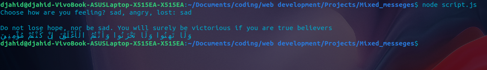

# Mixed Messages #
A little program for getting random *verse* form the *quran* depending on how you are feeling, to make you feel a little better and give you hope.

## How to use ##
When launching choose how you are feeling from the given list and you will get a random *quranic verse*.

## Example ##

## Code Explanation ##
In our code we have two objects containing our verses, one in english and the other in arabic.  
The user will be prompted to type how he's feeling and save his choice to a variable.    
The variabel will be used when calling the getRandomVerse function that calls the getRandomIdx function. then prints the varse both in english and arabic.